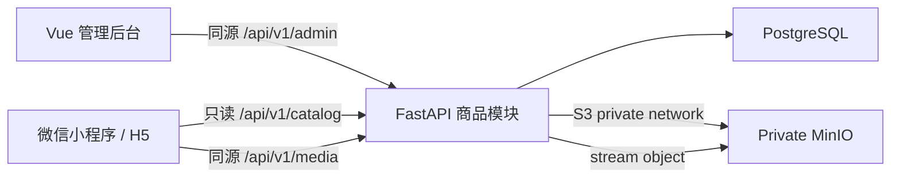

# Harbor Market 商品中心后端设计

## 架构



商品元数据由 PostgreSQL 管理，对象二进制由私有 MinIO 管理。MinIO 不承担公开 Web 服务；FastAPI 媒体端点只读转发已知对象并设置缓存头。这样 H5/小程序只需配置一个稳定 HTTPS 域名。

## 数据模型

### `categories`

| 字段 | 说明 |
|---|---|
| `code` | 稳定唯一业务编码，Excel 外键 |
| `name` / `description` | 显示名称和说明 |
| `parent_id` | 可选父类目 |
| `sort_order` / `is_active` | 排序和启停 |

### `products`

| 维度 | 字段 |
|---|---|
| 身份 | `product_code`, `name`, `subtitle` |
| 类目/状态 | `category_id`, `status`, `featured`, `sort_order` |
| 定价 | `base_price_cents`, `market_price_cents`, `currency`, `unit` |
| 库存 | `stock_status`, `inventory_count` |
| 展示 | `description`, `tags`, `selling_points` |
| 饮品/食品说明 | `ingredients`, `allergen_info` |
| 规格定制 | `specifications` JSON |

`specifications` 示例：

```json
[
  {
    "code": "temperature",
    "name": "温度",
    "selection_mode": "single",
    "required": true,
    "min_select": 1,
    "max_select": 1,
    "options": [
      {"code": "iced", "name": "冰", "price_delta_cents": 0, "sort": 0, "is_default": true},
      {"code": "hot", "name": "热", "price_delta_cents": 0, "sort": 1, "is_default": false}
    ]
  }
]
```

### `product_skus`

SKU 用于确实影响价格/库存的组合。`attributes` 是规格编码到选项编码的 JSON 映射；纯定制但不影响库存的选项保留在商品 `specifications` 中。

规格最多 20 组，每组最多 50 个选项；`selection_mode=single` 时 `max_select<=1`。
`required=true` 时 `min_select>=1`，且 min/max 不得超过选项数。规格与选项 code
在各自作用域内唯一。规格 JSON 序列化后最多 20,000 字符；SKU attributes 最多 20 项、
2,000 字符，并且 key/value 必须引用存在的规格/选项 code。

### `product_images`

- `cover`: 恰好 1（上架时必需）
- `gallery`: 最多 8（与封面组成最多 9 张首屏图）
- `detail`: 最多 20

直接上传的对象 key 为 `products/{product_id}/{role}/{uuid}.{ext}`；Excel 暂存提升为
`products/catalog/{product_code}/{role}/{uuid}.{ext}`。两者都是服务端生成的正式路径，公开响应按
`role` 和 `sort_order` 返回相对媒体 URL。暂存路径为 `products/staged/{product_code}/{uuid}.{ext}`，
最多保留 7 天；清理 outbox 同时承担配额记录和自动回收。

### `import_jobs`

记录操作人、原文件名、工作簿 SHA-256、幂等 key、dry-run、状态、计数摘要、逐行错误和完成时间，便于复核批量变更。

## 图片参考与业务规则

微信媒体选择 API 的单次选择上限不是商城商品图数量规范，因此数量由 Harbor Market 明确制定。公开瑞幸商品素材可作为视觉基准：商品图常见方图、名称、短营销说明、标签以及配料/制法提示；不复制其品牌内容。

建议素材：

- 封面/轮播：1:1，推荐 920×920，最小 640×640
- 类目横幅：约 2.6:1，具体由后续小程序版式裁切
- 详情图：推荐宽 750–920，允许纵向长图
- 后端只强制合法格式、文件大小和合理尺寸；构图质量由后台预览确认

## API 合约

### 管理员

```text
GET/POST           /api/v1/admin/categories
PATCH/DELETE       /api/v1/admin/categories/{id}
GET/POST           /api/v1/admin/products
GET/PATCH/DELETE   /api/v1/admin/products/{id}
POST               /api/v1/admin/products/{id}/images
PATCH/DELETE       /api/v1/admin/products/{id}/images/{image_id}
GET                /api/v1/admin/products/template.xlsx
POST               /api/v1/admin/products/import?dry_run=true|false
GET                /api/v1/admin/products/export.xlsx
GET                /api/v1/admin/import-jobs
GET                /api/v1/admin/import-jobs/{id}
POST/DELETE         /api/v1/admin/product-images/staging[/{object_key}]
GET/POST            /api/v1/admin/object-cleanup-jobs[/{id}/retry]
```

### 公开目录

```text
GET /api/v1/catalog/categories
GET /api/v1/catalog/products?q=&category=&page=&page_size=
GET /api/v1/catalog/products/{product_code}
GET /api/v1/media/{object_key}
```

## Excel 工作簿

### `Products`

`product_code`, `name`, `subtitle`, `category_code`, `status`, `base_price_yuan`, `market_price_yuan`, `unit`, `stock_status`, `inventory_count`, `featured`, `sort_order`, `tags`, `selling_points`, `description`, `ingredients`, `allergen_info`, `specifications_json`

### `SKUs`

`product_code`, `sku_code`, `name`, `price_yuan`, `market_price_yuan`, `stock_quantity`, `attributes_json`, `is_default`, `is_active`, `sort_order`

### `Images`

`product_code`, `image_type`, `object_key`, `alt_text`, `sort_order`

### `Dictionary`

状态、库存状态、图片类型、字段说明、示例和当前类目编码。金额解析用 `Decimal`，只接受最多两位小数，再精确转换成分。

## 导入算法

1. 限制文件大小，验证 XLSX 签名、工作表和表头。
2. 读取全部行并规范化空白、布尔值、枚举、金额和 JSON。
3. 检测文件内重复编码、跨表外键、数据库冲突、图片数量和 MinIO 对象存在性。
4. `dry_run` 保存验证摘要后返回，不变更商品数据。
5. 正式导入先为 staging→canonical 复制持久化清理意图，再在单个数据库事务中按类目引用、商品、SKU、图片顺序 upsert；关联图片和关闭意图同事务提交。
6. 提升成功后只排队 staging 源清理，由 `cleanup-worker` 异步执行，HTTP 响应不等待最多 500 次删除。
7. 任何错误回滚整个商品事务，激活目标清理意图，并在 `import_jobs.errors` 保存可读错误和清理任务 ID。
8. `X-Idempotency-Key` 与工作簿 SHA-256/模式绑定；最近任务 API 支持超时后的状态核对。3 小时未完成的导入由 worker 标为中断。

## 权限和安全

- Cookie path 扩展至 `/api/v1`，使管理 API 能收到会话。
- CORS/客户端支持 `PATCH`、`DELETE` 和 `multipart/form-data`。
- 管理 API 使用独立 `require_admin` 依赖。
- 管理 API 的非安全方法校验同源 `Origin`/`Referer`，并保留代理传递的外部 host/port。
- MinIO 凭据只存在于未跟踪 `.env`，响应中从不返回 access/secret key。
- 上传不接受客户端绝对路径；服务端检查 MIME、真实图像、大小、维度和数量。
- Bucket 保持私有，9000 不发布，9001 只绑定 loopback。

## 部署与回滚（交由 review 任务执行）

1. 停止写入后成对备份 PostgreSQL 和 MinIO，并记录已审查 commit、环境摘要和校验值。
2. 拉取已审查 revision，补齐新的 MinIO 环境变量和 host 数据目录。
3. 启动 MinIO 并确认私有健康，再执行 `alembic upgrade head`，最后滚动重建 backend/frontend。
4. 验证普通用户 403、管理员 CRUD、图片上传/读取、Excel dry-run/import/export。
5. 失败时保持写入关闭，切回已记录的旧 revision，在全新数据库中恢复配对的 PostgreSQL 备份并精确恢复同一批次 MinIO 对象，健康检查后再开放；已有商品写入时不得只依赖 Alembic downgrade。
