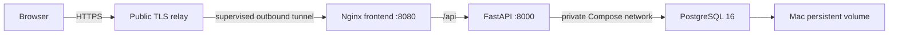

# Design Document

## Overview

Harbor Market version 1 is a small same-origin web application deployed on Jennifer's remote Mac. A Vue 3 single-page application is served by Nginx, which proxies `/api` to a FastAPI service. FastAPI persists local users in PostgreSQL database `xiangyue_xiamen`. Docker Compose owns the three application services and their private network; only the frontend HTTP port is bound to the Mac loopback interface.

Public HTTPS traffic reaches the Mac through a supervised outbound connector. A named Cloudflare Tunnel is the preferred custom-domain connector because it requires no inbound home-router port and does not share the existing Lightsail/Xray listener. A credential-free Cloudflare Quick Tunnel provides the first public verification URL until DNS-edit credentials are available. A reverse SSH tunnel to Lightsail remains a fallback only. None of these paths moves application execution or persistent data off the Mac.

## Steering Document Alignment

No optional steering documents exist for this new repository. The design follows the approved requirements document as the source of truth.

### Technical Standards

- Python 3.12, FastAPI, SQLAlchemy 2, Alembic, Pydantic settings, PostgreSQL 16, and Argon2 password hashing.
- Vue 3, TypeScript, Vite, Vue Router, a typed API client, Vitest, and Nginx.
- Docker Compose v2 with health checks, restart policies, a private application network, and a named database volume.
- Same-origin APIs and an expiring signed credential in a `Secure`, `HttpOnly`, `SameSite=Lax` cookie.

### Project Structure

```text
backend/                 FastAPI source, migrations, tests, Dockerfile
frontend/                Vue source, tests, Nginx config, Dockerfile
deploy/                  remote-Mac and public-ingress scripts/configuration
tests/e2e/               browser-level registration/login smoke test
compose.yaml             complete runtime topology
.env.example             non-secret configuration contract
```

## Code Reuse Analysis

### Existing Components to Leverage

- **Heimdall separation pattern:** Reuse the clear frontend/backend boundary, typed API access, Vue Router guard concept, and same-origin `/api` routing approach.
- **Docker health and restart facilities:** Use Compose-native readiness checks and `unless-stopped` restart policies.
- **macOS launchd:** Supervise the Docker-compatible engine, Compose startup, and outbound public connector after login/reboot.

### Patterns Explicitly Rejected

- Heimdall LDAP authentication is not copied.
- Secrets are never hard-coded in source or images.
- Authentication credentials always expire and are never stored in browser local storage.
- User API responses never expose password fields or password hashes.

## Architecture



### Modular Design Principles

- HTTP routes validate transport input and delegate authentication logic.
- Services own password verification and session creation.
- Repositories/SQLAlchemy models own persistence.
- Vue views compose reusable form controls and call one typed API client.
- Deployment scripts are idempotent and do not modify Hermes, native MySQL, or Xray unless a separately backed-up relay configuration is intentionally installed.

## Components and Interfaces

### FastAPI Application

- **Purpose:** Registration, login, logout, current-user lookup, health, and OpenAPI.
- **Interfaces:** `POST /api/v1/auth/register`, `POST /api/v1/auth/login`, `POST /api/v1/auth/logout`, `GET /api/v1/auth/me`, `GET /api/v1/health`.
- **Dependencies:** SQLAlchemy session, PostgreSQL, Argon2 password hasher, signed token library, settings.
- **Security:** Generic login errors, username normalization, database uniqueness, per-client rate limits, no secret logging.

### Vue Application

- **Purpose:** Responsive registration/login and an authenticated home screen.
- **Interfaces:** Vue Router routes `/register`, `/login`, and `/`; same-origin API calls with credentials included.
- **Dependencies:** Vue Router, typed API module, Lucide icons.
- **Security:** Restores auth from `/me`; stores no credential or trusted user record in local storage.

### Nginx Edge Container

- **Purpose:** Serve immutable frontend assets, SPA fallback, and proxy `/api` to FastAPI.
- **Interfaces:** Loopback-only Mac port `${APP_PORT:-8080}`.
- **Dependencies:** Frontend build output and Compose DNS name `backend`.

### PostgreSQL

- **Purpose:** Durable user source of truth.
- **Interfaces:** Private Compose network only; health check via `pg_isready`.
- **Persistence:** Named volume plus scheduled `pg_dump` backups on the Mac.

### Public Connector

- **Purpose:** Publish one HTTPS hostname without inbound home-router port forwarding.
- **Preferred interface:** Named Cloudflare Tunnel from the Mac to the loopback application port and a dedicated hostname such as `app.hermes-node.com`.
- **Initial publication interface:** Credential-free Quick Tunnel supervised by launchd, producing a temporary `https://*.trycloudflare.com` URL.
- **Fallback interface:** `ssh -N -R 127.0.0.1:<relay-port>:127.0.0.1:<app-port>` plus a separate TLS virtual host on Lightsail, only after explicit firewall and port review.
- **Constraint:** Database, backend port, Docker socket, SSH, and macOS administration ports stay private.

## Data Models

### User

```text
id: UUID primary key
username: normalized string, case-insensitive unique
password_hash: Argon2 encoded hash
is_active: boolean, default true
created_at: timezone-aware timestamp
updated_at: timezone-aware timestamp
last_login_at: nullable timezone-aware timestamp
```

### Authentication Credential

```text
sub: user UUID
username: normalized username
iat: issued-at timestamp
exp: mandatory expiry timestamp
```

The credential is signed with a random environment-provided secret and sent only in an HttpOnly cookie. Logout expires the cookie immediately.

## Runtime Configuration

- `.env` exists only on the deployment host and is excluded from Git.
- Required secrets: PostgreSQL password and authentication signing secret.
- Production sets secure cookies, trusted host/origin values, and a finite token lifetime.
- Compose binds the web service to `127.0.0.1` so only the outbound connector can publish it.
- Migrations run before the API begins accepting requests.

## Error Handling

1. **Duplicate registration**
   - **Handling:** Database uniqueness plus application conflict mapping returns HTTP 409.
   - **User impact:** Inline message explains that the username is already in use.
2. **Invalid login or disabled user**
   - **Handling:** One generic HTTP 401 response prevents account discovery.
   - **User impact:** The password is cleared and the username remains editable.
3. **Database unavailable**
   - **Handling:** API readiness fails; Compose health check reports unhealthy and restart policy retries.
   - **User impact:** Nginx returns a temporary service error rather than false success.
4. **Public connector unavailable**
   - **Handling:** launchd restarts the connector; the origin remains private and fails closed.
   - **User impact:** Public hostname is temporarily unavailable while local data remains intact.

## Testing Strategy

### Unit Testing

- Pytest covers validation, hashing, token expiry, auth outcomes, and response safety.
- Vitest covers form validation, API errors, route protection, and auth restoration.

### Integration Testing

- Backend tests run against PostgreSQL where database semantics matter.
- `docker compose config` and service health checks validate the assembled stack.
- A migration smoke test starts from an empty database and verifies the users schema.

### End-to-End Testing

- Playwright opens the deployed site at desktop and iPhone viewports.
- It creates a unique user, logs in, verifies the protected page, refreshes, logs out, and confirms protected-route redirection.
- Public DNS, TLS, API health, static assets, and container restart behavior are checked independently.

## Deployment and Rollback

1. Copy or clone the repository to the remote Mac and create its untracked production `.env`.
2. Start the selected Docker engine and configure it to start automatically.
3. Build and start Compose; verify migrations and all health checks locally.
4. Install the supervised Quick Tunnel for initial public verification; later replace it with the named tunnel/DNS hostname without changing the existing Xray hostname.
5. Run public browser tests.
6. Roll back by restoring the previous image/commit and restarting Compose; public connector removal does not delete database data.
