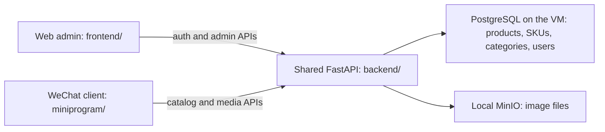

# Harbor Market: project folders and shared backend

This guide describes the merged local project on 2026-10-01.

The primary project is `/Users/jennifer.huang/Documents/AI_Workspace/Tools/harbor_market`.
The WeChat Mini Program branch was merged into `main` as `bfae315` and pushed to GitHub.
That merge also contains the mock payments implementation from `codex/wechat-payments-mock`
(`8e53909`); the payments branch has no additional commits to merge.
The web client, native WeChat client, server code, and deployment configuration now live here.
The development PostgreSQL service and its persistent database live on
`aqa01-i01-ocr01.int.rclabenv.com`, outside this Mac directory.

## First-layer folders

- `backend/`: the shared Python FastAPI server. It contains HTTP API routes, business rules,
  database models, Alembic schema migrations, backend tests, and the backend Docker image definition.
- `frontend/`: the Vue browser application, including administrator login and product management.
  Its Nginx configuration serves the built web files and forwards API requests to FastAPI.
- `miniprogram/`: the native WeChat shopping client, its DevTools configuration, and client tests.
  Its pages run inside WeChat or the DevTools simulator. It is not a separate server.
- `deploy/`: scripts and configuration for starting, deploying, checking, backing up, and restoring
  the application. `development-db/` contains the persistent VM database deployment and runbook.
- `tests/`: checks that exercise the application as a whole; currently the authentication smoke test.
- `docs/`: explanations and project review documents, including this guide and the database review.
- `backups/`: local database, media, and release backup files. These are ignored by Git.
- `output/`: generated screenshots, diagrams, service checks, and DevTools evidence, ignored by Git.
- `outputs/`: generated deliverables such as product import-template spreadsheets and preview images,
  ignored by Git.
- `.data/`: private local runtime files and development records. It includes local MinIO media,
  database provisioning/cutover records, and recovery files. It is ignored by Git.
- `.spec-workflow/`: requirements, designs, implementation task lists, templates, and workflow records.
- `.github/`: GitHub Actions configuration for continuous integration.
- `.git/`: Git history, branches, and linked worktree metadata.
- `.idea/`: local IDE settings, ignored by Git.
- `.pytest_cache/`: generated Python test cache, ignored by Git.
- `.ruff_cache/`: generated Python lint cache, ignored by Git.

The most useful root files are `.env` (private runtime configuration), `.env.example`
(configuration examples), `compose.yaml` (service definitions), `compose.development-db.yaml`
(the persistent remote database override), and `README.md` (startup and operation instructions).

## One backend for two clients

The Mini Program is the shop interface inside WeChat. WeChat provides its runtime and APIs such as
`wx.request()` for HTTP requests and local storage for the cart. Our `backend/` supplies Harbor
Market's business API and real catalog data. This implementation does not use a separate WeChat
cloud-functions backend.



Both clients currently reach the local API through Nginx at `http://127.0.0.1:8080`.
The web admin uses `/api/v1/auth/...` and `/api/v1/admin/...`, with administrator authentication.
The Mini Program uses the public `/api/v1/catalog/...` and `/api/v1/media/...` routes.
Those routes belong to the same FastAPI application and read the same database and media storage.
Database credentials remain in the server's environment; the Mini Program receives HTTP responses.

Locally, Docker runs the frontend/Nginx, FastAPI backend, cleanup worker, and MinIO. The cleanup
worker uses the same backend code and database to retry object cleanup jobs. PostgreSQL runs on the
VM. The native Mini Program runs in DevTools or on a phone, outside Docker.

## How real products appear in WeChat

1. Sign in to the web admin at `http://127.0.0.1:8080/admin/products`.
2. Create an active category and a product with its SKUs, prices, and stock.
3. Upload the cover image, select one active default SKU, and publish the product.
4. Open or pull down to refresh the Mini Program catalog.

The web admin writes product records into PostgreSQL and image files into MinIO. The Mini Program
asks the shared backend for published products. No second database or catalog synchronization is
needed. Public products must be published, their category must be active, and only active SKUs are
shown. Publishing requires exactly one cover image and exactly one active default SKU.

The catalog displays products once they are created and published. It reads the real persistent
development database; the Mini Program is not connected to mock catalog fixtures.

## Run the merged Mini Program

From the main project, with Docker running, start the shared services with:

```bash
bash deploy/start-development.sh
```

In WeChat DevTools, import this main project's `miniprogram/` folder and select Compile.
Its `project.config.json` uses `touristappid` for local simulation and `src/` as its source root.
The API address defaults to `http://127.0.0.1:8080`. In the Mini Program, Settings → 连接设置 can
test and save a different API origin; enter the origin without `/api/v1`.

On a phone, localhost refers to the phone itself. Phone preview needs a usable Test/owned AppID
and a backend address reachable by that phone. Use a shared HTTPS API origin when preparing device
preview. The Mini Program setup guide describes the AppID and release paths.

## Mini Program development worktree

The fresh development checkout is
`/Users/jennifer.huang/Documents/AI_Workspace/Tools/harbor_market-wechat-miniprogram`,
on branch `wechat-miniprogram`, created from the updated `main`.
It contains the complete project, including both the Mini Program and mock payments backend.
Import its `miniprogram/` subfolder into WeChat DevTools when developing on this branch.

The primary `harbor_market` checkout remains on `main` and runs the shared local services using
its private `.env`. The Mini Program in the development worktree reaches those services at
`http://127.0.0.1:8080`; it does not need database credentials in its client files.
Old worktrees and their local artifacts are archived under the primary project's ignored
`.data/worktree-archives/` directory. Their commits remain part of `main`.

For client checks in the fresh worktree, using Node.js 22:

```bash
cd /Users/jennifer.huang/Documents/AI_Workspace/Tools/harbor_market-wechat-miniprogram/miniprogram
npm ci
npm test
npm run lint
```

## Current feature boundary

Product/category browsing, SKU selection, and the cart are implemented. The cart is stored on the
device. It does not yet create a backend order or reserve stock. Customer WeChat login, checkout,
order management, and live WeChat Pay still need implementation in the shared backend and client.
The shared backend already contains a mock payment state machine and provider for development;
it does not process live payments or enable checkout in the Mini Program.

## Source references

- [Backend API router](../backend/app/api/router.py)
- [Public catalog API](../backend/app/api/routes/catalog.py)
- [Catalog business rules](../backend/app/services/catalog.py)
- [Web admin API client](../frontend/src/api/catalog.ts)
- [Mini Program API client and origin](../miniprogram/src/api/client.js)
- [Mini Program catalog requests](../miniprogram/src/api/catalog.js)
- [Mini Program local cart](../miniprogram/src/state/cart-store.js)
- [Mini Program setup](../miniprogram/README.md)
- [Persistent database operations](../deploy/development-db/README.md)
